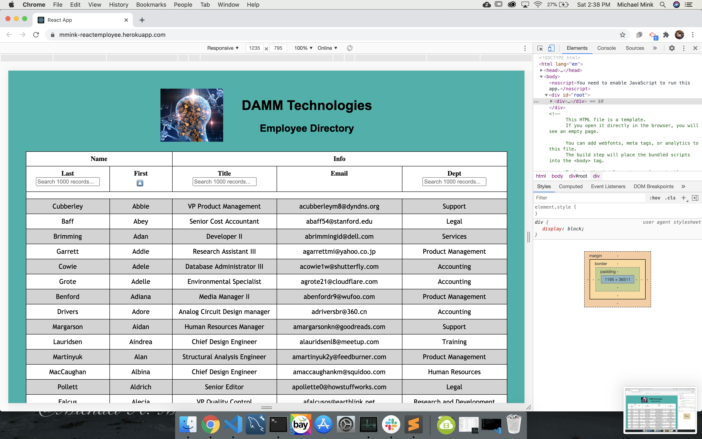

## The title of this project is Employee Directory.
        
License - 

## Table of Contents 
* [Installation](#Installation-instructions) 
* [Usage](#Usage) 
* [License](#License)
* [Contributing](#Contributing)
* [Tests](#Tests)
* [Questions](#Questions)
* [DeployedLink](#Link)
* [ScreenShots](#ScreenShots)

### - Installation Instructions
    Download code, run index.html if web based, run npm install, then run node index.js if node based.

### - Usage
    The end user will be able to view, sort and filter an employee list.

### - License
    The license used for this project is the MIT license.

### - Contributing
    To suggest improvements email <mmink@michaelamink.com> or log an issue under the specific project in the GitHub repo - 
[GitHub](https://github.com/cermqm)

### - Tests
    Test viewing, sorting and filtering the solution.

### - Questions
    For questions contact Michael A. Mink at the following email -

<mmink@michaelamink.com>

    You can also log an issue under the specific project on GitHub - 

[GitHub](https://github.com/cermqm)

### - Deployedlink
[React Employee List](https://mmink-reactemployee.herokuapp.com/)

### - Screenshots

